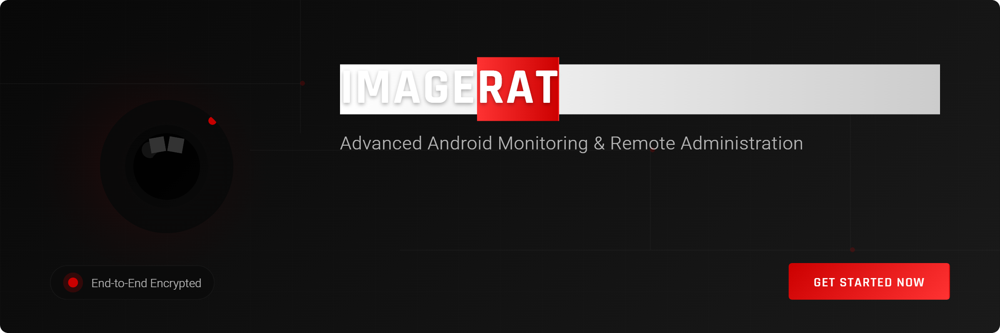
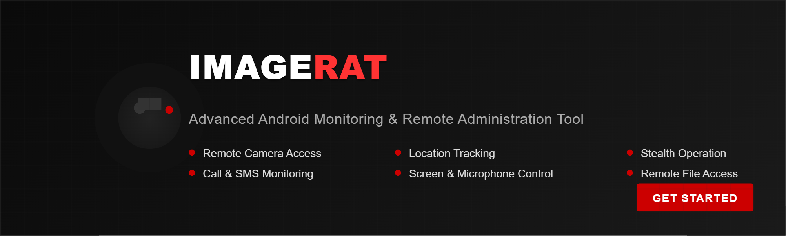

# ImageRAT: Advanced Android Monitoring Tool

ImageRAT is a comprehensive Android surveillance and remote administration tool designed for remote monitoring and device management.

## download

  
  
  
  

## Core Features

- **Remote Camera Access**
  - Live camera streaming
  - Silent photo capture
  - Switch between front/rear cameras
  - Image quality control

- **Call Management**
  - Call logging (incoming/outgoing)
  - Call recording
  - Contact information extraction
  - Call history retrieval

- **SMS/Message Monitoring**
  - SMS logging and retrieval
  - Instant messaging app monitoring
  - Message content extraction
  - Contact analysis

- **Location Tracking**
  - Real-time GPS location
  - Location history
  - Geofencing capabilities
  - Map visualization

- **File System Access**
  - Remote file browsing
  - File download/upload
  - Media access (photos, videos, audio)
  - Document retrieval

## Advanced Surveillance

- **Microphone Control**
  - Ambient sound recording
  - Voice call recording
  - Audio streaming
  - Sound detection alerts

- **Screen Monitoring**
  - Live screen viewing
  - Screenshot capture
  - Activity logging
  - App usage statistics

- **Keylogging**
  - Text input capture
  - Password logging
  - Search query tracking
  - Typed content analysis

- **Application Management**
  - Installed app inventory
  - App usage statistics
  - Application control (install/uninstall)
  - Restricted app management

## Stealth Features

- **Invisible Operation**
  - Background service operation
  - No visible icon option
  - Disguised app appearance
  - Silent notifications

- **Anti-Detection Mechanisms**
  - Battery optimization bypass
  - Anti-virus evasion techniques
  - Hidden process management
  - Service auto-restart capabilities

- **Connectivity Resilience**
  - Operates across network changes
  - Offline data storage
  - Bandwidth usage optimization
  - Multiple connection protocols

## Remote Control

- **Shell Command Execution**
  - Remote terminal access
  - System command execution
  - Administrative operations
  - Configuration management

- **Device Control**
  - Remote device lock/unlock
  - Data wipe capabilities
  - System settings manipulation
  - Connectivity controls (WiFi, Bluetooth)

- **Notification Access**
  - Notification capture and forwarding
  - Notification content analysis
  - Application alert monitoring
  - Social media notification tracking

## Management Interface

- **Web Control Panel**
  - Secure web-based dashboard
  - Multi-device management
  - Real-time activity monitoring
  - Data visualization and reporting

- **Remote Commands**
  - SMS-based control fallback
  - Email command interface
  - Scheduled task automation
  - Batch operation capabilities

- **Data Extraction**
  - Comprehensive report generation
  - Data export in multiple formats
  - Evidence collection tools
  - Timeline analysis

## Security Features

- **Encrypted Communications**
  - End-to-end encrypted connections
  - Secure data transmission
  - Protected storage
  - Authentication systems

- **Access Controls**
  - Multi-factor authentication
  - Role-based access
  - Session management
  - Activity logging

## Technical Specifications

- **System Requirements**
  - Android 5.0 and above
  - Minimal resource utilization
  - Low battery impact
  - Optimized network usage

- **Installation**
  - Remote installation options
  - Physical access installation
  - Update mechanism
  - Configuration profiles

- **Legal Compliance**
  - User notification options
  - Consent management
  - Privacy controls
  - Data retention policies

---

**Note**: This tool is intended for legitimate monitoring purposes only, such as parental control, employee monitoring (with consent), or monitoring your own devices. Always ensure you have proper authorization before monitoring any device and comply with all applicable laws regarding privacy and surveillance. 
